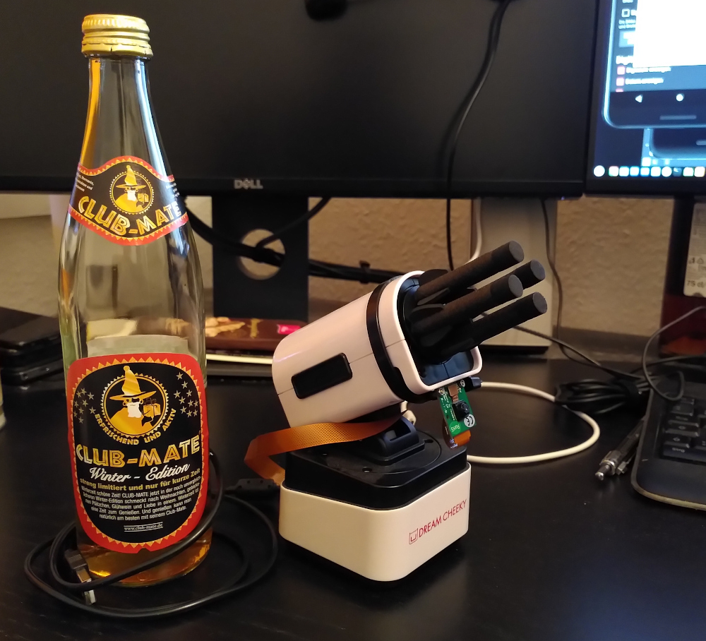

# Rocket Launcher OS
Python script with web interface for Raspberry Pi controlling a USB (nerf) rocket launcher.

## Hardware
I recently bought the "Dream Cheeky iLaunch Thunder" bluetooth rocket launcher, but the related app was not available anymore on the App Store. So I decided to replace the original board from the iLaunch Thunder with a Raspberry Pi Zero.



The motors are controlled by [L9110S DC Motor Drive Modules](https://www.amazon.de/gp/product/B07Y15GL6J/). I removed the screw connectors from the boards and soldered the wires directly on it so that it fits in the small box of the rocket launcher.

## Software
The python script is started via systemd as a service and opens a web server on port 80 with a website which allows to control the motors via keyboard keys W, S, A, D and Space.

Unpack the repo content into `/opt/rocket`. Copy the service file into `/etc/systemd/system`. Enable and start the service via `systemctl enable rocket.service && systemctl start rocket.service`. Now, point your webbrowser to your Raspberry Pi's IP and your will see the rocket launcher control website.

The website can display a live image provided by the "Motion" software on port 8081. For this, you need to attach a Raspberry Pi camera module and install the appropriate package via `apt install motion` and configure it. Example:

<details>
  <summary><b>/etc/motion/motion.conf</b></summary>

```
############################################################
# Daemon
############################################################

# Start in daemon (background) mode and release terminal (default: off)
daemon on

# File to store the process ID, also called pid file. (default: not defined)
process_id_file /var/run/motion/motion.pid

###########################################################
# Capture device options
############################################################

# Videodevice to be used for capturing  (default /dev/video0)
# for FreeBSD default is /dev/bktr0
videodevice /dev/video0

# v4l2_palette allows one to choose preferable palette to be use by motion
# See motion_guide.html for the valid options and values.  (default: 17)
v4l2_palette 17

# The video input to be used (default: -1)
# Should normally be set to 0 or 1 for video/TV cards, and -1 for USB cameras
# Set to 0 for uvideo(4) on OpenBSD
input -1

# The video norm to use (only for video capture and TV tuner cards)
# Values: 0 (PAL), 1 (NTSC), 2 (SECAM), 3 (PAL NC no colour). Default: 0 (PAL)
norm 0

# The frequency to set the tuner to (kHz) (only for TV tuner cards) (default: 0)
frequency 0

# Override the power line frequency for the webcam. (normally not necessary)
# Values:
# -1 : Do not modify device setting
# 0  : Power line frequency Disabled
# 1  : 50hz
# 2  : 60hz
# 3  : Auto
power_line_frequency -1

# Rotate image this number of degrees. The rotation affects all saved images as
# well as movies. Valid values: 0 (default = no rotation), 90, 180 and 270.
rotate 0

# Flip image over a given axis (vertical or horizontal), vertical means from left to right
# horizontal means top to bottom. Valid values: none, v and h.
flip_axis none

# Image width (pixels). Valid range: Camera dependent, default: 320
width 720

# Image height (pixels). Valid range: Camera dependent, default: 240
height 576

# Maximum number of frames to be captured per second.
# Valid range: 2-100. Default: 100 (almost no limit).
framerate 2

############################################################
# Live Stream Server
############################################################

# The mini-http server listens to this port for requests (default: 0 = disabled)
stream_port 8081

# Quality of the jpeg (in percent) images produced (default: 50)
stream_quality 50

# Output frames at 1 fps when no motion is detected and increase to the
# rate given by stream_maxrate when motion is detected (default: off)
stream_motion off

# Maximum framerate for stream streams (default: 1)
stream_maxrate 2

# Restrict stream connections to localhost only (default: on)
stream_localhost off

# Limits the number of images per connection (default: 0 = unlimited)
# Number can be defined by multiplying actual stream rate by desired number of seconds
# Actual stream rate is the smallest of the numbers framerate and stream_maxrate
stream_limit 0

# Set the authentication method (default: 0)
# 0 = disabled
# 1 = Basic authentication
# 2 = MD5 digest (the safer authentication)
stream_auth_method 0

# Authentication for the stream. Syntax username:password
# Default: not defined (Disabled)
; stream_authentication username:password

# Percentage to scale the stream image for preview
# This is scaled on the browser side, motion will keep sending full frames
# Default: 25
; stream_preview_scale 25

# Have stream preview image start on a new line
# Default: no
; stream_preview_newline no


.....................
```
</details>
